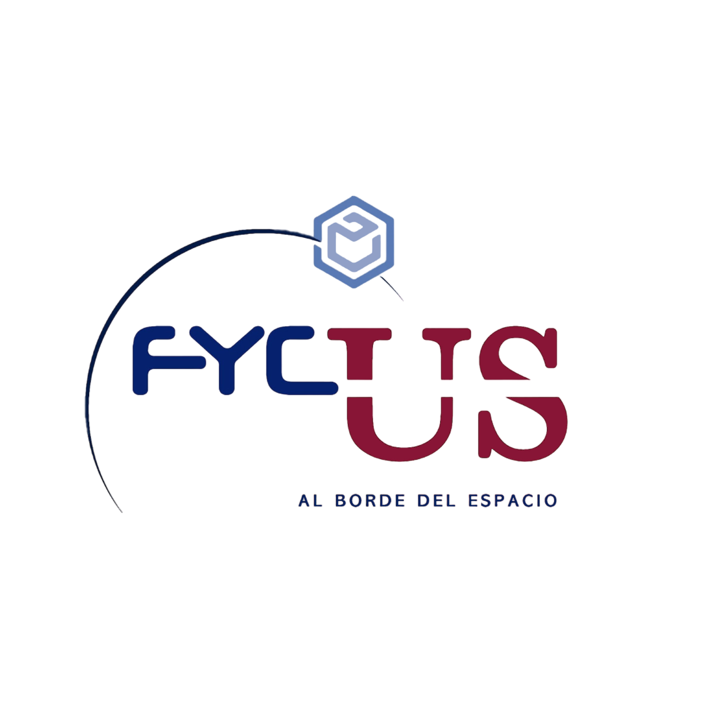

# CCSDS-Protocol-FyCUS23
Transfer Frame and Bus Packet used in FyCUS 2023 project.

<div align="center">

</div>


## ✒️ &nbsp; Author 
* **Rubén Torres Bermúdez** - [RubenT17](https://github.com/RubenT17)

## ⚙️ &nbsp; How to use

### Bus packet:
```
bus_packet_t packet = {0};
uint8_t data[BUS_PACKET_DATA_SIZE] = {100,1,12,234,34,3};
buffer_in[BUS_PACKET_BUS_SIZE] = {0};
bus_packet_EncodePacketize(1, 90, 1, data, 6, buffer_in);
if (bus_packet_Decode(buffer_in, &packet) != HAL_OK)
    Error_Handle();
```


### TF packet:
```
uint8_t data[TF_PACKET_DATA_MAX_SIZE] = {100,13,32,76,12,98,34,12,65,23};
tfph.end_flag = TF_PACKET_NOT_TRUNCATED;
tfph.tfvn = TF_PACKET_TFVN;
tfph.mapid = TF_PACKET_DEFAULT_MAP;
tfph.vcid = TF_PACKET_DEFAULT_VCID;
tfph.scid = TF_PACKET_DEFAULT_SCID;
tfph.source_dest_id = TF_PACKET_SOURCE;
tf_packet_SetData(data, 10, NULL, 0, &tfph, &tfdf);
tf_packet_Packetize(0, &tfph, &tfdf, tf_buffer_out);
if(tf_packet_Decode(tf_buffer_out, tfph.length, &tfph, &tfdf) != HAL_OK)
    Error_Handler();
```


## 📄 &nbsp; License

This project is licensed under the General Public License - see the LICENSE.md file for details

## ❓ &nbsp; Where to ask questions 

| Type                            | Platforms                               |
| ------------------------------- | --------------------------------------- |
| 🚨 **Bug Reports**              | [GitHub Issue Tracker](https://github.com/RubenT17/CCSDS-Protocol-FyCUS23/issues)                 |
| 🎁 **Feature Requests & Ideas** | [GitHub Issue Tracker](https://github.com/RubenT17/CCSDS-Protocol-FyCUS23/issues)                 |
